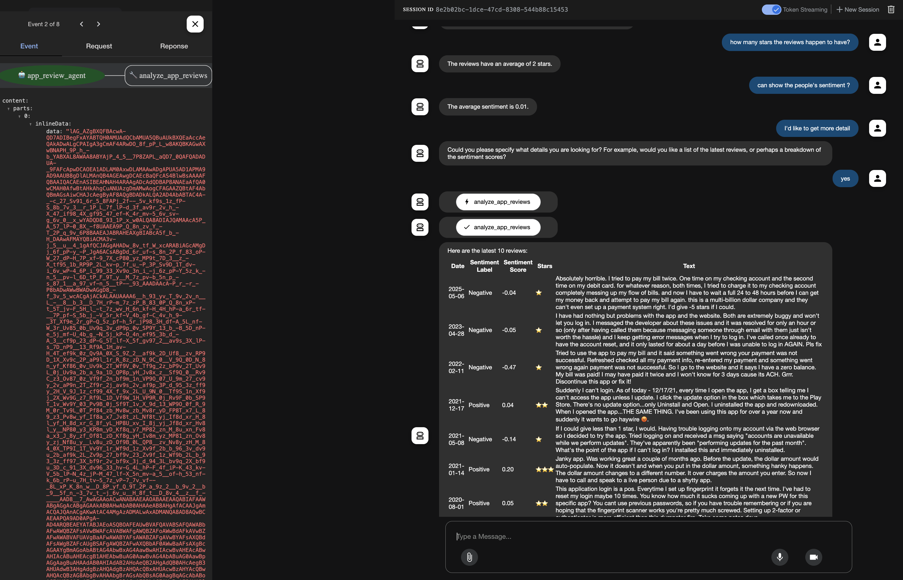

# Google Agent Development Kit (ADK) Sample Project

This project demonstrates the implementation of a custom agent using Google's Agent Development Kit (ADK). The agent is designed to handle queries about family members, including checking names and their genders.

## Technologies Used

- Python 3.x
- Google Agent Development Kit (ADK)
- Google Gemini 2.0 Flash Model
- FastAPI (used by ADK for the web interface)

## Project Structure

- `multi_tool_agent/`
  - `agent.py` - Main agent implementation with name and gender checking functionality
  - `__init__.py` - Package initialization
  - `.env` - Environment configuration file

## Setup and Installation

1. Install Google ADK:
   ```bash
   pip install google-adk
   ```

2. Configure Environment Variables:
   - Create a `.env` file in your project's root directory
   - Add your Google API key:
     ```
     GOOGLE_GENAI_USE_VERTEXAI=False
     GOOGLE_API_KEY=your-api-key-here
     ```

3. Run the Agent:
   ```bash
   adk web
   ```
   This will start the ADK web server at http://localhost:8000

## Features

- Name availability checking
- Gender identification for family members
- Interactive web interface
- Real-time response generation using Google's Gemini model

## Screenshots

Here are the screenshots demonstrating the agent's functionality:


### Interaction wi reviews / sentiment agent



## Usage

1. Start the server using `adk web`
2. Open your browser and navigate to http://localhost:8000
3. Start a new conversation with the agent
4. You can ask questions like:
   - "Is [name] available?"
   - "What gender is [name]?"
   - "Can you check if [name] exists?"

## Note

Make sure to keep your API keys secure and never commit them directly to version control. The `.env` file should be added to your `.gitignore`.
